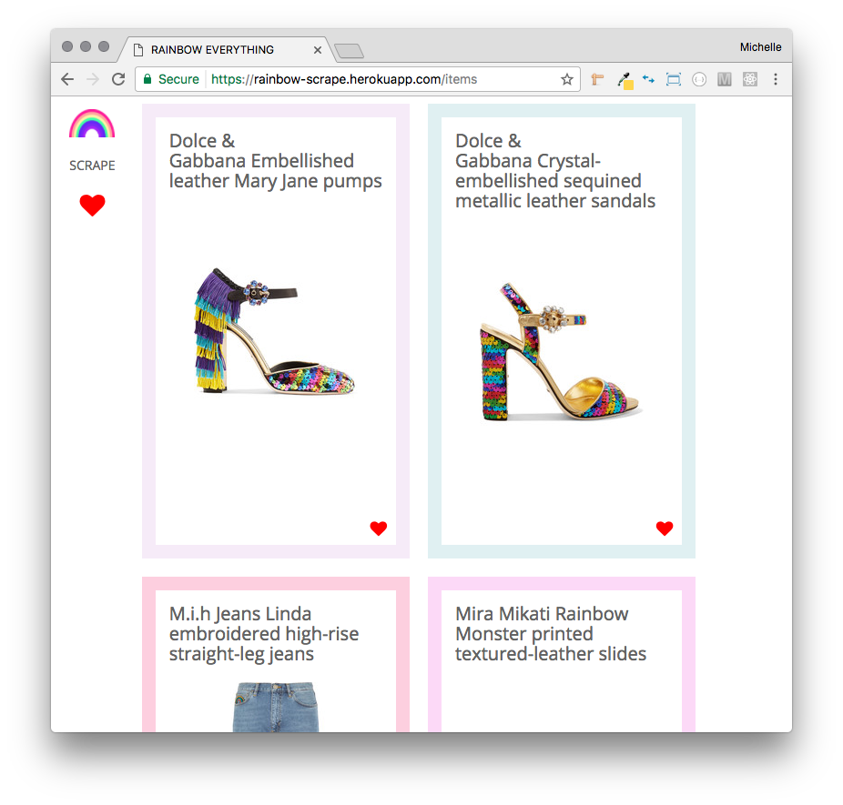
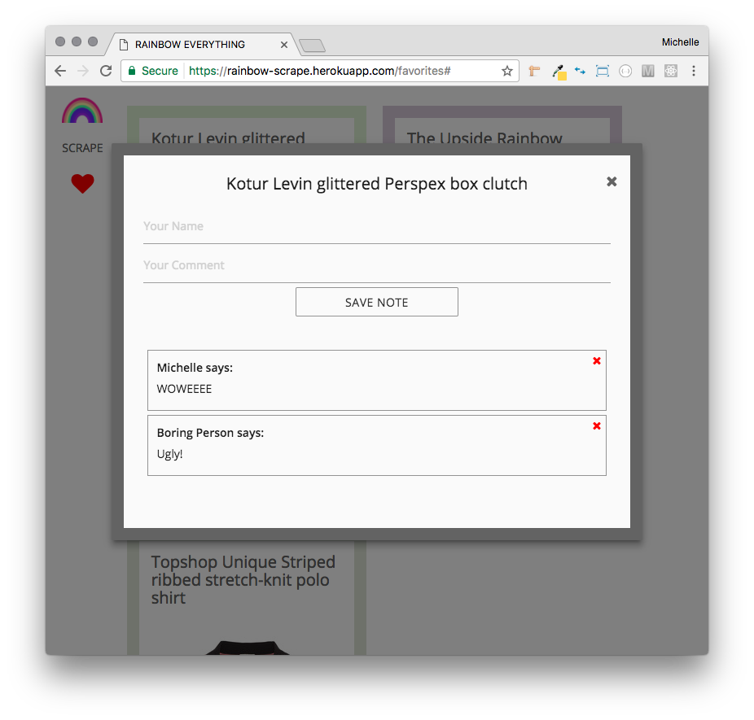

#  Rainbow Scraper 

## Overview

[See it in action!](https://rainbow-scrape.herokuapp.com/)

This full-stack app scrapes the web for rainbow clothing and accessories. 

Items can be saved to favorites, where users can then leave comments and also delete them.

The app uses the cheerio npm package to grab the site content and Mongoose to save it to a MongoDB database.

## Technologies Used:

* Node.js
* Express
* MongoDB
* Handlebars.js
* jQuery
* npm Packages
	* [Express](https://www.npmjs.com/package/express)
	* [body-parser](https://www.npmjs.com/package/body-parser)
	* [request](https://www.npmjs.com/package/request)
	* [mongoose](https://www.npmjs.com/package/mongoose)
	* [morgan](https://www.npmjs.com/package/morgan)
	* [cheerio](https://www.npmjs.com/package/cheerio)
	* [express-handlebars](https://www.npmjs.com/package/express-handlebars)

* [Materialize](http://materializecss.com/)
* [Font Awesome](http://fontawesome.io/)
* [Google Fonts API](https://fonts.google.com)